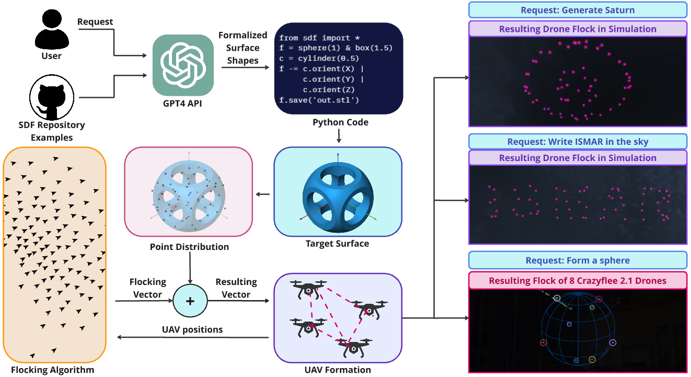

# FlockGPT: Guiding UAV Flocking with Linguistic Orchestration



Welcome to the FlockGPT repository! This project introduces FlockGPT, a pioneering approach to UAV flocking control using natural language through generative AI. FlockGPT is designed to enable intuitive orchestration of a drone flock of any size, allowing users to achieve desired geometries with ease.

## Overview 
FlockGPT is a novel approach to drone flocking control using natural language and generative AI. It features an LLM-based interface for user interaction and a flocking technology system that ensures smooth movement of the drone swarm. Our user study confirmed its intuitive control and high performance. This repository contains the demo code for FlockGPT.

## Installing

### 1. Installing ROS
This package was developed using the ROS noetic framework, so it is recommended to use this version of ROS. To install it on Ubuntu 20.04 follow the tutorial [here](http://wiki.ros.org/noetic/Installation/Ubuntu) 

### 2. Installing CrazySwarm
Follow the instructions [here](https://crazyswarm.readthedocs.io/en/latest/installation.html) to install the CrazySwarm framework.

### 3. Install the package
Inside the CrazySwarm folder navigate to the ROS workspace and clone this package to the src folder

```bash
cd crazyswarm/ros_ws/src
git clone https://github.com/Taintedy/flock_gpt.git
```

To test the LLM demo ROS-TCP-Endpoint package is required

```bash
git clone https://github.com/Unity-Technologies/ROS-TCP-Endpoint.git
```

build the workspace

```bash
cd crazyswarm/ros_ws
catkin_make
source devel/setup.bash
```

### 4. Install python requirements
Navigate to the package
```bash
cd crazyswarm/ros_ws/src/flock_gpt
```
and install the requirements
```bash
pip install -r requirements.txt
```

To make pycrazyswarm package visible in the FlockGPT package run command

```bash
echo "export PYTHONPATH=$PYTHONPATH:$HOME/path/to/ros_ws/src/crazyswarm/scripts" >> ~/.bashrc
source ~/.bashrc
```


## Usage

### OpenAI API key

First the OpenAI API key in `gpt_sdf.py` inside the `scripts` folder needs to be setup. On line 32 write your API key.

```python
OPENAI_API_KEY = 'YOUR API KEY HERE'
```

### Simulator
Install the Unity simulator [here](https://github.com/mikk686/flock_GPT/releases/tag/simulator). 
Before running the LLM demo the `tcp_ip` and the `tcp_port` parameters have to be configured in the `endpoint.launch` file inside the ROS-TCP-Endpoint package. For more information please visit the ROS-TCP-Endpoint [repository](https://github.com/Unity-Technologies/ROS-TCP-Endpoint) .

```bash
roslaunch ros_tcp_endpoint endpoint.launch
```

Run the simulator and specify the tcp ip and the tcp port in the simulator as well.

Finally, launch the FlockGPT demo by running:

```bash
roslaunch flock_gpt sim_swarm_control.launch
```

### RVIZ

FlockGPT demo can be launched inside RVIZ by running the command:

```bash
roslaunch flock_gpt swarm_control_test.launch
```

### CrazySwarm 

Configure the Crazyflie drones using [this](https://crazyswarm.readthedocs.io/en/latest/configuration.html) tutorial.
Now run this command in the terminal


```bash
roslaunch flock_gpt cf_show.launch
```

The controls are

```
Keyboard button "1" -- Takeoff
Keyboard button "2" -- Execute formation
Keyboard button "3" -- Land
Keyboard button "w" -- Next formation
```

For this demo only a sphere and box formations were considered. To add a custom formation navigate to `cf_show_node.py` and reconfigure the `cost` variable on line 164. To create a custom sdf refer to [this](https://github.com/fogleman/sdf) repository.


## Citation

If you use this framework in your research, please cite it as:

```
@ARTICLE{2024arXiv240505872L,
       author = {{Lykov}, Artem and {Karaf}, Sausar and {Martynov}, Mikhail and {Serpiva}, Valerii and {Fedoseev}, Aleksey and {Konenkov}, Mikhail and {Tsetserukou}, Dzmitry},
        title = "{FlockGPT: Guiding UAV Flocking with Linguistic Orchestration}",
      journal = {arXiv e-prints},
     keywords = {Computer Science - Robotics},
         year = 2024,
        month = may,
          eid = {arXiv:2405.05872},
        pages = {arXiv:2405.05872},
          doi = {10.48550/arXiv.2405.05872},
archivePrefix = {arXiv},
       eprint = {2405.05872},
 primaryClass = {cs.RO},
       adsurl = {https://ui.adsabs.harvard.edu/abs/2024arXiv240505872L},
      adsnote = {Provided by the SAO/NASA Astrophysics Data System}
}
```

For any questions or issues, feel free to [open an issue](https://github.com/Taintedy/flock_gpt/issues).
